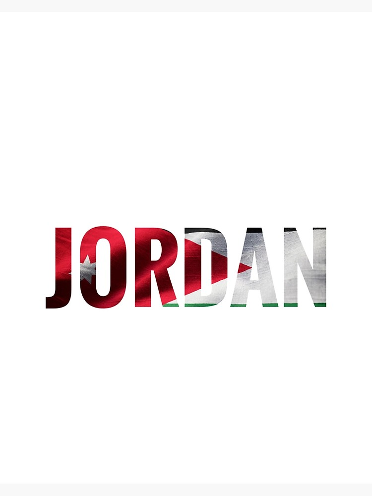

<!DOCTYPE html>
<html lang="en">
<head>
  <meta charset="UTF-8">
  <meta name="viewport" content="width=device-width, initial-scale=1.0">
  <title>My Resume</title>
</head>
<body>{
  font-family:Arial,sans-serif;
  line-height: 1.6;
  margin: 0;
  padding: 20px;
}
  container{
    max-width: 800px;
    margin: auto;
}
  h1, h2, h3{
    margin-bottom: 10px;
  }
  <ul>{
    list-style-type: none;
    padding: 0;
  }
  <li> {
      margin-bottom: 5px;
  }
    <style>
  </head>
       </section>
        <section>
          
  <body>
    

      <header>
        <h1>Francis Benj B. Jordan</h1>
        
BSITWMA

      </header>
      <section>
        <h2>contact information</h2>
        <ul>
          <li>2023@fit.edu.ph</li>
          <li>Phone:(63) 9951956028</li>
          <li>LinkedIn: linkedIn.com</li>
          </ul>
      </section>
      <section>
        <h2>Education</h2>
        <ul>
          <li>BSITWMA - FEUTECH, 2023-2024</li>
        </ul>
        </section>
        <section>
          <h2>Experience</h2>
          <h3>BSITWMA</h3>
          
Newbie in Html, Css, and Javascript

        </section>
        <section>
          <h2>Skills</h2>
          <ul>
            <li>Html, c++, JavaScript, Css</li>
            <li>framewroks, bootstrap</li>
            <li>other skills: teamwork, can communicate properly, time management</li>
          </ul>
        </section>
        <section>
          
        </section>
     

</body>
</html>

